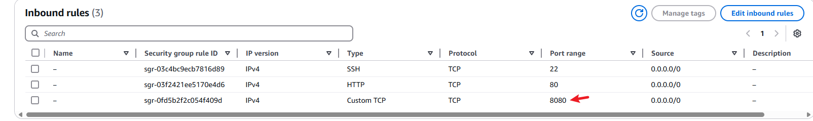

# Objective

The objective of this project is to develop a static website (HTML and CSS), using Docker to containerize the application with Nginx as the base image for which we would access the application and deploy it to a kubernetes cluster.

## Setting up the project

We launched an AWS EC2 instance, instance type is t3.medium, its specifications (2vCPU with 4 GiB memory) and an Ubuntu AMI

*Note: its important that we use an instance type with specifications that matches the tools we'll use (Docker and kubernetes), for example minikube requires 2vCPU to run and requires a minimum memory allocation of 2GB. Kind kubernetes requires 2GB to 4GB but only needs 1 vCPU to run* 

In the instance we created an HTML `index.html` and CSS `styles.css` file for a simple web application using VIM text editor 

 ## Initializing Git repository and pushing to Github

- A new repository on github is created and named as "Containerization-and-Container-Orchestration".

- We created a new directory on our instance named it as *my-web-server*, and created 2 files in this directory (index.html & Styles.css) 

- We cloned the github repository on this instance using the command as shown below. 

*Note that we have cloned outside the github repository. this is done so as to prevent future error when merging, pushing and pulling changes to the remote repositories*

- We moved `index.html` & `styles.css` files from the *my-web-server* directory into the git repository.

  here is the list of files we now have in our repository. 

- While in the git directory/repository, we added all our files to be staged and ready for commit

- Next we commited our staged files which is now our main branch. We can verify that the 2 files have been commited by looking at the output after the command is executed. 

- Next, we pushed our commited files to github. It automatically prompts us to enter out github username and password. Our password is the same as personal access token which can been obtained from github developer settings. 

## Dockerizing the application

## Installing Docker on debian based linux system Ubuntu 

Here is the code used to install Docker on our ubuntu EC2 instance 

Updates the package list for APT, downloads the last package list from repositions, ensuring the system is up to date

Installs essential packages including certificate authorities, a data transfer tool (curl), and the GNU privacy guard for secure communication and package verification

creates a directory (/etc/apt/keyrings) with specific permissions (0755) for storing keyring files, which are used for docker's authentication

Downloads the Docker GPG key using `curl`

Sets read permissions for all users on the Docker GPG key file withing the APT keyring directory

 **Adding the repositories to Apt sources**

The `echo` command creates a Docker APT repository configuration entry for the Ubuntu system, incorporating the system architecture and Docker GPG key, and then "sudo tee/ etc/apt/sources.list.d/docker.list > /dev/null" writes this configuration to the "/etc/apt/sources.list.d/docker.list" file 

updates the package list for Apt

Installs latest version of docker 

execute this to run docker command without using superuserdo. Need to log out from the system and log back in for the changes to take effect 

We can confirm that docker is not active and running on the system. 

## Creating a Dockerfile 

The next step involves creating a Dockerfile script, the script uses Nginx as our base image, and sets the working directory for Nginx. it also allows us to copy both our applications (index.html & styles.css) into the default Nginx web directory. 

The directive notifies Docker to EXPOSE port 80 (HTTP web traffic). It directs the application inside the container to use port 80 for communication. 

**EXPOSE 80** is intended only for communication, it serves purely as a documentation feature for the image and does not actively open the port, to enable access, a security rule must be configured to allow inbound traffic on port 80

We configured our `index.html` and `style.css` files to contain a basic html and CSS code for a simple web application

To build the dockerfile, we ran the following command

To run the dockerfile build we simply used the following command 

*Note that the command above allows the container to run in detached mode allowing the container to run in the background. By default, containers run in the foreground, and the terminal is attached to the container's standard input/ouptupt. The container stays active in the foreground to continue serving files, which can cause the terminal to appear unresponsive—this is common behavior for web servers like NGINX.*

Port mapping ( -p 8080:80): when the command is executed it maps port 8080 on the host maching (EC2 instance) to port 80 inside the container. 
We need to make sure our security group connected to the instance allows inbound traffic on port 8080

for testing, we opened the web browser and navigate to `http://public-ip:8080`

### Pushing to Docker hub

To push our docker image, first thing we did is login to dockerhub from the terminal

We created a new repository on docker hub `dara433/my-web-server`

Next, we tagged our docker image to this repository using the docker tag command 

We can proceed to push this image using the `docker push` command 

## Setting up Kind kubernetes Cluster

### Installing Go

- Download the tarball, open the terminal and use wget or curl to download

- Extract the downloaded file to /usr/local

Add Go's binary directory to your system path by editing the `~/.profile` and adding the following line 

                    export PATH=$PATH:/usr/local/go/bin
                    
                    Or
                    
                    
                    export PATH=$PATH:$(go env GOPATH)/bin

- and apply changes 

- Verify that go has been installed

### Install kind using go

- Add Go's binary directory to your system path by editing the ~/.profile and adding the following line 

                    export PATH=$PATH:/usr/local/go/bin
                    
                    Or
                    
                    
                    export PATH=$PATH:$(go env GOPATH)/bin

*Note if one line does not work, use the other*

- Create a kuberneter cluster

- The next command installs `kubectl` a command-line tool used to interact with kubernetes clusters. it manages and deploys resources (pods, deployments) within the cluster. 

## Deploying to Kubernetes

### Kubernetes Deployment 

Deployment with kubernetes involves the process of taking our application (in this case, docker image) and running it on a kubernetes cluster, ensuring that it scales, manages resources efficienty and stays resilient. 

We created our script for deployment with a YAML file. It contains all the specifications for our deployment including the metadata for deployment, replicas and our docker image repository (dara433/my-web-server:1.0)

We applied the deployment file using the command below 

We can verify that the our deployment file is now active and running, as seen below, our deployment file (now listed as a pod) is now active and running, 

### Kubernetes Service

Once the application is deployed, it needs a way to be accessed by other parts of the system. this is where services come into play, a service acts as a stable endpoint to connect our application. In this case, we used **ClusterIP** as our service, it enables our application to be accssible only from within the cluster . 

 For kubernetes service, we created another YAML script file 

Our YAML script file includes the type of service we are using (CLusterIP) and specifies the port on the pods to which traffic will be forward (HTTP port 80).

To deploy kubernetes service, the following command was run

We can verify that kubenetes service is now running on our cluster, and using the service type as ClusterIP allows our application to be accessible only from within the cluster. 

## Accessing the Application externally

To access the application through our browser, we need to route traffic from the EC2 instance to the Kubernetes cluster. While there are various approach to achieve this, the reverse proxy is one method that stands out due to its reliability and consistency. 

To set up a reverse proxy we installed Nginx on the EC2 instance. The Nginx on our instance will act as a reverse proxy, routing incoming traffic from outside the cluster into the kubernetes service, hence serving as a gatewway for requests from external clients.  

To install Nginx on our EC2, we simply used these commands

this updates the package list for apt, then installs Nginx on the instance. 

 **Port Forwarding** 

*The following command was executed to forwards traffic coming from localhost:7070 on the EC2 instance to the ClusterIP service*

*Note: while we could have used 8080, we used port 7070. This is done to avoid any conflicting proceesses that may occur since port 8080 is already in use for our docker container. 
A new security group was added to our instance, it allows incoming traffic TCP on port range 7070.* 

Now that we have successfully installed Nginx. We need to reconfigure the Nginx server to act as a reverse proxy that forwards traffic from our instance to the kubernetes cluster. Here are the steps we followed

 - open the Nginx configuration file

 

the default server sets the configuration to listen to port 80 (HTTP). However, we have modified the following in the server block .

    server_name your-ec2-public-ip;

    location / {
        proxy_pass http://your-kubernetes-service-ip:service-port;
        proxy_set_header Host $host;
        proxy_set_header X-Real-IP $remote_addr;
        proxy_set_header X-Forwarded-For $proxy_add_x_forwarded_for;
    }

We have updated the server name to the ec2-public-IP 54.151.201.14. The Kubernetes-service is accessible at `127.0.0.1`, this IP address is bound to the EC2 localhost. 
Remember our kubernetes service is exposed via ClusterIP and only accessible within the cluster, using 127.0.0.1 allows the kubernetes service to be accessible externally.  

once this is done, we tested the configuration file to make sure there is are no errors

then restarted the Nginx server 

we can access our application by using the EC2 public IP http://54.161.201.14

**How the traffic flows**

- Client request: The browser sends a request to http://54.161.201.14 (EC2 public ip)
- Nginx reverse proxy: Nginx receives the request and forwards it `127.0.0.1:7070`, the local port where the kubernetes service is exposed
- Port Forwarding: Traffic is routed from the EC2 localhost to the kubernetes ClusterIP service.
- Response: Kubernetes processes the request and sends the response back through the reverse proxy to the client. 

The setup ensures controlled external access to the kubernetes application while maintaining security and flexibility

